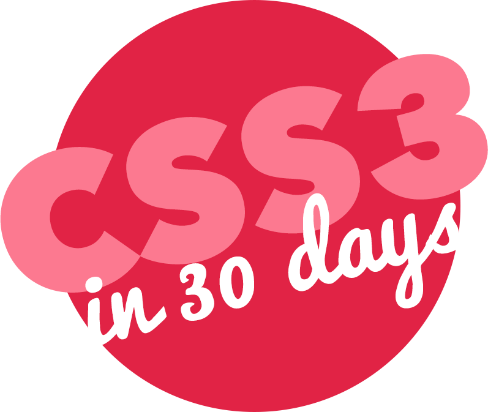

# CSS-30days

---

在 Javascript30 天的挑戰進行到第五天時，愛上這種學習節奏，藉由 FreeCodeCamp 找到了 Brad Hussey 創立的教程網站[codecollege](https://codecollege.ca/)，CSS3 in 30days 是他開立的一堂免費教程，稍微了解第一堂課後(個人覺得老師及教程內容很可愛)，便決定把他加入到每日任務內，繼續努力加強囉!

---

### `每週主要任務--`

**平日** : 完成每日程式碼及前日筆記

**假日** : 修改當週程式碼(+加平日任務)

---

| Javascript 30 天 |          主題          |                內容                 |            新增內容            |
| :--------------: | :--------------------: | :---------------------------------: | :----------------------------: |
|      DAY 1       |     Fancy Buttons      | 建立五種型態、大小、效果不同的按鈕  |          增加兩種按鈕          |
|       DAY2       |    Sexy Typography     |       創建兩種特殊的文字效果        |          增加兩種文字          |
|       DAY3       |      Clip Images       |      剪裁出四種不同形狀的圖片       |        增加兩種剪裁圖形        |
|       DAY4       | Sexy Registration Form |         建立帶有特效的表單          |     新增一個表單及響應設計     |
|       Day5       |  Useful Broken Images  |    更改圖片無法顯示時的默認樣式     |        新增一種默認樣式        |
|       Day6       |      Print Styles      |   創建讓列印機可以漂亮輸出的樣式    |               無               |
|       Day7       |   Image Manipulation   |      運用四種過濾效果改變圖片       |        增加兩種過濾效果        |
|       Day8       |      8-bit Mario       | 畫出 8-bit 瑪利歐並實現跳起來的效果 | 畫一隻皮卡丘搭配簡易發電效果 ❤ |
|       Day9       |     Modern Layouts     |          製作三種布局版面           |   新增運用 flex 完成布局版面   |
|      Day10       |     Pricing Table      |             製作價目表              |    新增運用 flex 完成價目表    |
|      Day11       |        IE Hacks        |    針對 IE6-9 增加指定註釋及樣式    |               無               |
|      Day12       |     CSS Variables      |        練習運用 CSS Variable        |     新增 CSS Variable 運用     |
|      Day13       |     Sticky Footer      |            建立頁尾置底             |   將 Day16 頁面加入頁尾置底    |
|      Day14       |     Sticky Header      |            建立頁首置頂             |   將 Day16 頁面加入頁首置頂    |
|      Day15       |     Sticky Sidebar     |          建立固定的側邊欄           |    將 Day16 頁面加入側邊欄     |
|      Day16       |      Modal Window      |        運用 CSS 實現互動視窗        |         新增一互動視窗         |
|      Day17       |         Pacman         |    用 CSS 實現小精靈追逐鬼魂動畫    |                                |
|      Day18       |        Tooltips        |       製作四種方向的工具提示        |                                |
|      Day19       | Animated Progress Bar  |          用 CSS 製作進度條          |                                |
|      Day20       |    Animated Pyramid    |      用 CSS 製作金字塔動畫效果      |                                |
|      Day21       |        Spinners        |         製作兩種動畫旋轉器          |                                |
|      Day22       |     Flexbox Layout     |        運用 flexbox 布局版面        |                                |
|      Day23       |     CSS3 Accordion     |  運用 CSS 製作點擊標題展開文字效果  |                                |
|      Day24       |        Supports        |            學習@support             |                                |
